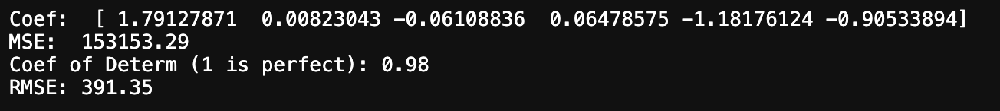
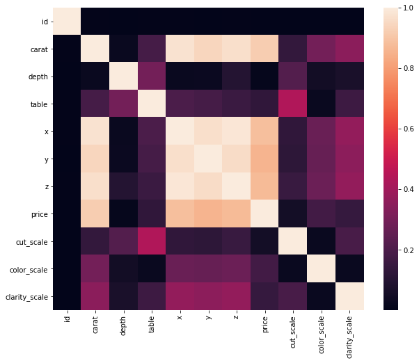
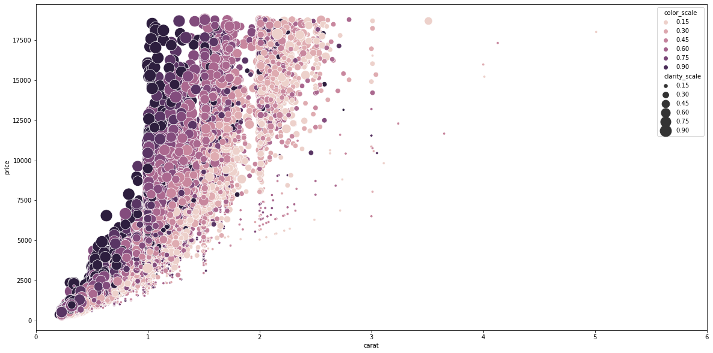

# Second Run
-------------
# Check this in [notebooks/second_run](https://github.com/WyattGwyon/diamond-price-predictions/blob/master/notebooks/second_run/1_Exploration_Cleaning_2nd.ipynb)
I got some better results this round. Probably because of applying some of the techniques I have learned about during the preprocessing stage. For the moment, the preprocessing is where a lot of important decisions are made that will influence the effectiveness of the models. Training the models in comparison is fairly easy and a blast! I know the devil in the details is hiding in the hyper-parameters but I am enjoying trying different models. But once preprocessing is over, it is like 'plug-n-play'.

Below I will just post the coefficients, MSE, R2(coefficient of determination), and RMSE, along with the scatterplot and distribution of both y_pred and y_test. Now because we put the data through a log transformation we need to undo the log.

# Linear Regression

# KNN

# SVR

# Random Forest

This is the result without even adjusting hyper-parameters. Random Forest is pretty much on point and faster than SVR. Now, this is still the training data I haven't opened the real test data of course. But my first round, through this data set I got these results from LinearRegression:

So, I must have learned something since then...

___________
# First Run
___________
# Predicting the Prices of Diamonds using Supervised Machine Learning
We have a dataset of over 40000 diamonds. 
By applying some supervised Machine Learning and a little pressure, we might get these diamonds to talk. 

## First Step:

We need to clean the data. Fortunately, this data is very clean. There are no nulls or nans, not a even peep. 

## Second Step: 

We need to make some difficult decisions when it comes to dropping data. Looking at the the correlation between features, we decided cut x, y, and z because they had such strong colinearity with carats. Since carats measure mass it makes sense that mass is direcctly related to measurements.

#### Outliers
Diamonds are a very special category their value can vary widely. One could imagine some very extremely expensive diamonds exist that might not be repesentative of a "regular" diamond pricing scale. Let's say that it some of the outliers may go too far in excess of price that we might want to adjust them.
We also made an attempt to fish out the outliers and reform them but that caused some big problems with our predictions. So for the moment they stay.

This plot gives us a good visualization of four important ascpects that we wanted to consider: the carat/price relationship and where the color/clarity quality scale fall. 

## Third Step:
We have to apply some models. 
Our objective was to get an RMSE measurement of 800 or lower. THat did not happen.

We did a typical LinearRegression with no changes and we achieved a RMSE of 1200. This did not get any better with all of out experimenting. When we went back to clean up the outliers that made out RMSE double. There were many models that we tried and they all gave the same results.

We need to understand the parameters of each a little better and devise some type of pipleline, as I understand it. 

# Conclusion
Inconclusive...this will need some serious imporvement but the process was very fun and interesting. 